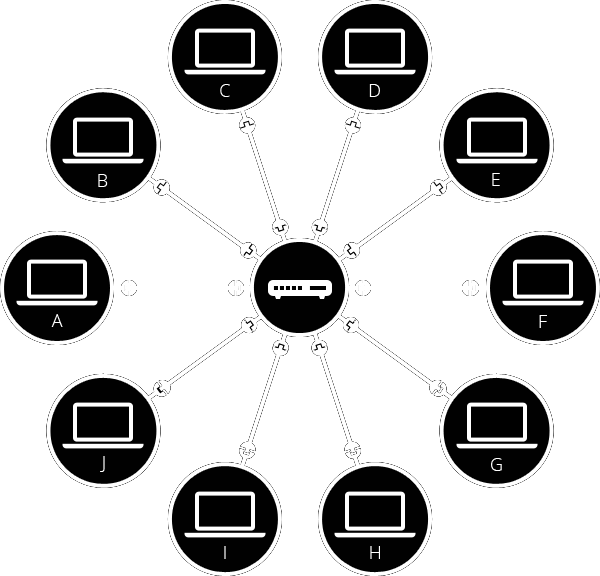

# Internet

A Internet é a "espinha dorsal" da Web, uma infraestrutura técnica que torna sua existência possível. As várias tecnologias que suportam a Internet evoluíram ao longo do tempo, mas o modo como ela funciona não mudou muito: a Internet é uma grande rede de computadores que se comunicam entre si.

Para que os computadores possam se comunicar é necessário conectá-los de alguma maneira, por exemplo, através de um cabo ou via Wi-Fi.

Conectar muitos computadores é uma tarefa complexa, assim, para resolver este problema, cada computador em uma rede é conectado a um pequeno computador especial chamado de roteador, o qual garante que uma mensagem enviada de um determinado computador chegue ao computador de destino correto.

Na imagem anterior, para enviar uma mensagem ao computador B, o computador A deve enviar a mensagem ao roteador, que, por sua vez, a encaminha para o computador B e garante que a mensagem não seja entregue ao computador C.

Mas como conectar centenas, milhares e bilhões de computadores? Note que ainda existem outras redes mundo afora: seus amigos, seus vizinhos, colegas de trabalho...

A infraestrutura de telefonia já conecta sua casa à qualquer pessoa no mundo, então, é o recurso ideal para esta tarefa. Assim, para conectar nossa rede à infraestrutura de telefonia, precisamos de um equipamento especial denominado modem, que transforma as informações da nossa rede em informações gerenciáveis pela infraestrutura de telefonia e vice-versa.

Para que diferentes redes possam trocar mensagens entre si, é necessário conectar-se a um Provedor de Serviços de Internet (ISP), ou seja, uma empresa que gerencia alguns roteadores especiais que estão todos interligados, e também podem acessar roteadores de outros provedores. Assim, uma mensagem pode ser transportada através de uma rede de redes.

Basicamente, a Internet consiste em toda esta infraestrutura de redes.

---

📋 **Referência:**

"How does the Internet work?" - [Mozilla](https://developer.mozilla.org/en-US/docs/Learn/Common_questions/How_does_the_Internet_work)

---

:heart: [POST no INSTAGRAM](https://www.instagram.com/p/CN1HvSdsXnF/)
